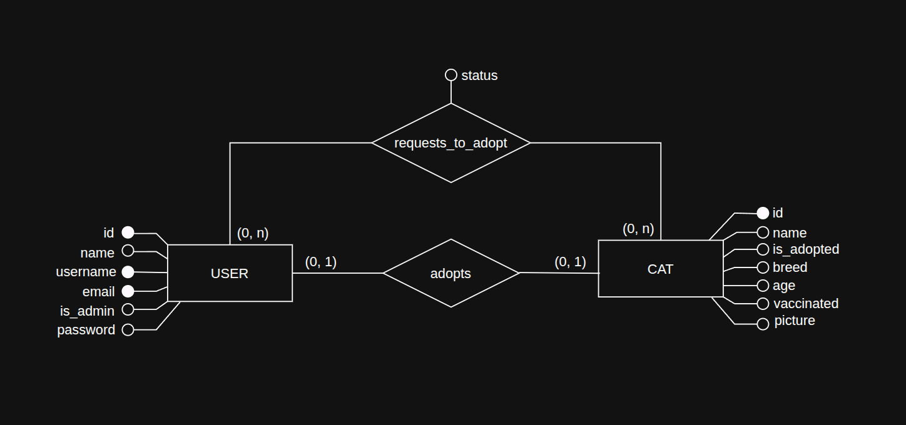
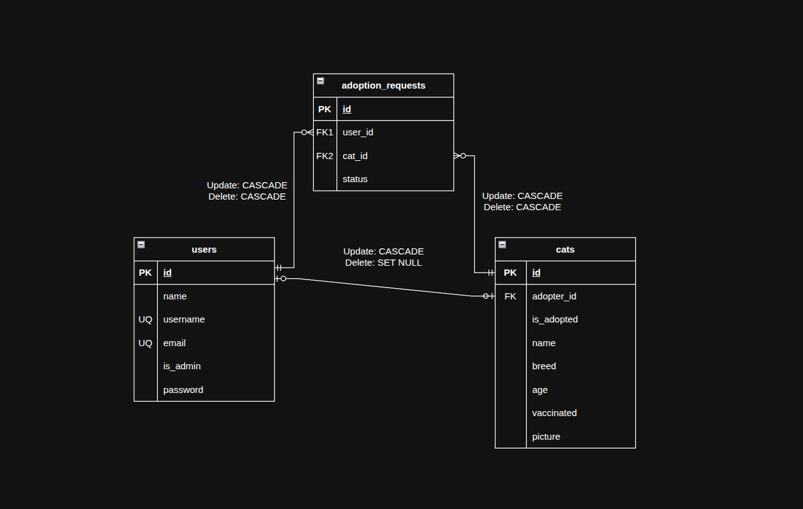

# Descripción

## Sistema de Adopción de Gatos con Laravel

Desarrolla una aplicación web completa para gestionar las adopciones en una protectora de gatos. <br>
El objetivo es aplicar todo lo aprendido en el curso Aprende Laravel desde cero para construir <br>
una aplicación realista, funcional y motivadora.

## ¿Qué vas a construir?

Una aplicación con dos grandes áreas: la parte  de Backend y la parte de Frontend.

### 🔧 Área de gestión (backend)

- Crear, editar, eliminar y listar gatos (CRUD completo).
- Guardar información como: raza, edad, estado de vacunación y fotografía.
- Aceptar o rechazar solicitudes de adopción.
- Marcar a un gato como adoptado (sin eliminarlo de la base de datos).

### 👤 Área de usuario (frontend)

- Cualquier persona podrá registrarse e iniciar sesión.
- Una vez autenticado, podrá adoptar un solo gato.
- El sistema ocultará del frontal los gatos ya adoptados.

### Los requisitos indispensables para aprobar el proyecto son

- Migraciones y modelos bien definidos.
- Gestión completa de usuarios.
- CRUD de gatos funcional en la parte de gestión.
- Frontend con vista de gatos no adoptados.
- Adopción funcional con control por usuario.
- Sistema de aceptación y registro de adopciones.
- Datos iniciales cargados con seeders.
- Proyecto limpio y organizado.


#### Si quieres destacar y aumentar el nivel de tu proyecto (no evaluable)

- Usa componentes visuales bonitos (Bootstrap, Tailwind…).
- Implementa subida real de fotos.
- Añade validaciones y mensajes amigables.
- Crea un panel de perfil para usuarios.

<hr>

## Instalacion y uso
1. **Clona el repositorio:**
   ```sh
   git clone git@github.com:hdz-kevin/cat-adoptions.git
   cd cat-adoptions
   ```
2. **Instala dependencias:**
   ```sh
   composer install
   npm install && npm run build
   ```
3. **Configura el entorno:**
   ```sh
   cp .env.example .env
   php artisan key:generate
   ```
   Edita el .env con los datos de tu base de datos.

4. **Hacer accesible el public storage:**
   ```sh
   ./artisan storage:link
   ```
5. **Ejecuta migraciones y seeders:**
   ```sh
   ./artisan migrate --sed
   ```
6. **Inicia el servidor:**
   ```sh
   ./artisan serve
   ```
   accede a http://localhost:8000

### Credenciales de prueba
Incluye credenciales para el admin y usuarios normales:

```markdown

- **Admin:**  
  Email: admin@admin.com  
  Password: password

- **Usuario normal:**  
  Email: (elige uno de los generados en la base de datos)  
  Password: password
```

## Funcionalidades principales
- <input checked="" disabled="" type="checkbox"> CRUD de gatos (admin)<br>
- <input checked="" disabled="" type="checkbox"> Registro e inicio de sesión de usuarios<br>
- <input checked="" disabled="" type="checkbox"> Adopción de gatos (máx. 1 por usuario)<br>
- <input checked="" disabled="" type="checkbox"> Solicitudes de adopción (max. 6 por usuario) con estados (pendiente, aprobada, rechazada)<br>
- <input checked="" disabled="" type="checkbox"> Panel simple de perfil de usuario<br>
- <input checked="" disabled="" type="checkbox"> Seeders y datos de prueba realistas<br>
- <input checked="" disabled="" type="checkbox"> Validaciones y mensajes amigables<br>
- <input checked="" disabled="" type="checkbox"> Subida real de fotos con Dropzone<br>

## Documentacion extra

- Diseño Conceptual de la base de datos
  

- Diseño Logico de la base de datos
  
